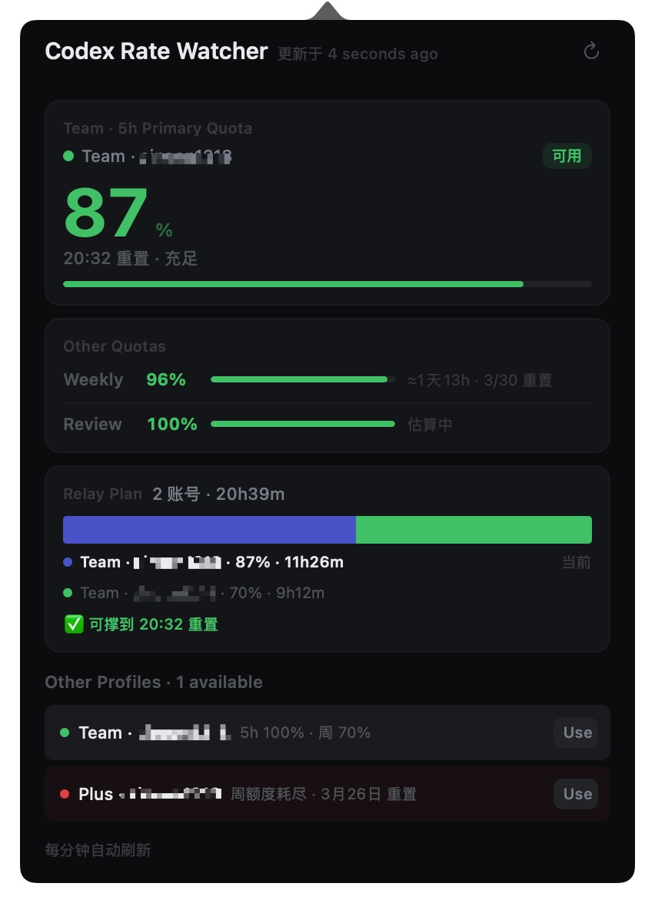

<div align="center">

# ⚡ Codex Rate Watcher

### You're deep in flow. Codex is on fire. Then — `429`.

**That never has to happen again.**

A macOS menu bar app that monitors your [OpenAI Codex](https://openai.com/index/codex/) (ChatGPT Pro / Team) rate-limit usage in real time — with burn-rate predictions, intelligent multi-account relay, a CLI tool, and Raycast integration.

[](README.md)
[](README.zh-CN.md)
[](README.ja.md)
[](README.ko.md)
[](README.es.md)
[](README.fr.md)
[](README.de.md)


<p>
  
</p>

<p>
  
</p>

**Real-time quota monitoring · Burn-rate prediction · Intelligent relay · Multi-account switching · CLI + Raycast**

</div>

---

## 🤯 The Problem

You're pair-programming with Codex, refactoring a critical module, deep in flow state — and the rate limit wall hits. No warning. No countdown. Just a cold `429 Too Many Requests`.

You wait. You refresh. You have no idea when your quota resets or how fast you burned through it.

OpenAI gives you **zero visibility** into your Codex rate limits. No dashboard. No API. Just a hard stop when you least expect it.

**Codex Rate Watcher fixes this.**

---

## 🎯 Features

### 📊 See Everything

Track all three quota dimensions in a single glance from your menu bar — no more flying blind.

- **5-hour primary window** — the limit that hits you mid-session
- **Weekly aggregate window** — the slow burn that locks you out on Friday
- **Code review limit** — tracked separately so it never sneaks up on you
- **Always-on reset countdown** — every quota card shows its reset time, even when you're not blocked
- **Dynamic status bar icon** — green → yellow → orange → red based on quota health

### 🔥 Stay Ahead

Don't just monitor — predict. The burn-rate engine uses linear regression over real usage samples to tell you *exactly* when each quota runs out.

- **Precise countdown** — "1h32min until exhausted, resets 14:30"
- **Smart alerts** — configurable thresholds (50%, 30%, 15%, 5%) with native macOS notifications
- **Escalating urgency** — low-threshold alerts include sound to grab your attention in flow state
- **Per-window dedup** — you never get spammed by the same warning twice

### 🌐 Work Anywhere

Codex rate monitoring available on to every surface you work on.

- **⌨️ Global Hotkey** — `⇧⌃⌥K` toggles the popover from any app (customizable)
- **🖥️ CLI tool** — `codex-rate` for terminal-first monitoring, JSON output, and scripting
- **🔍 Raycast extension** — search "Codex" for instant quota checks without leaving your keyboard

### 👥 Multiple Accounts

Managing multiple ChatGPT Pro or Team accounts? Covered.

- **Auto-capture** — auth snapshots are saved automatically on detection
- **Smart scoring** — weighted algorithm recommends the best account to switch to
- **One-click switch** — current auth is auto-backed up before swapping
- **Plan badges** — Plus vs. Team clearly labeled in the UI
- **Self-healing store** — orphaned snapshots are auto-discovered and registered on startup (SHA256-deduplicated)


### 🔄 Auto-Switch

v1.5.0 introduces automatic account switching — the app detects when your current account is running low and seamlessly switches to the best available profile.

- **Smart trigger** — only switches when the best profile's score leads by 20+ points (conservative threshold)
- **5-minute cooldown** — prevents flip-flopping between accounts
- **Undo via notification** — every auto-switch sends a macOS notification with an "Undo" action button
- **Off by default** — enable via right-click menu → "自动切换账号"
- **Persisted config** — your preference survives app restarts


### 🧠 Intelligent Relay

v1.6.0 introduces **predictive relay planning** — the app uses burn-rate estimation to plan an optimal relay sequence across all your accounts, telling you exactly when all quotas will run out.

<p>
  
</p>

- **Burn-rate projection** — uses linear regression to predict when each account will exhaust
- **Visual timeline** — proportional color bar showing each account's contribution
- **3 relay strategies** — Reset-aware (default, maximizes reset recycling), Greedy (use least-remaining first), Max-runway (use most-remaining first)
- **Preemptive auto-switch** — switches 5 minutes _before_ predicted exhaustion instead of waiting for low-percent thresholds
- **Survive-until-reset** — tells you whether the relay chain covers the gap until the earliest quota reset
- **CLI support** — `codex-rate relay` shows the full relay plan in your terminal

---

## 🖥️ CLI Tool

v1.4.0+ introduces `codex-rate` — a companion CLI for terminal-first monitoring.

### Install

```bash
# Build from source
swift build -c release --target codex-rate
cp .build/release/codex-rate ~/bin/

# Or download from Releases (included in the zip alongside the .app)
```

### Usage

```bash
# Show current usage
codex-rate status

# JSON output (for scripts, Raycast, piping)
codex-rate status --json

# List all saved auth profiles
codex-rate profiles

# Continuous watch mode (refreshes every 30s)
codex-rate watch
codex-rate watch --interval 15

# Usage history with sparklines
codex-rate history
codex-rate history --hours 6

# Relay plan across all accounts
codex-rate relay
codex-rate relay --strategy greedy
codex-rate relay --json
```

### Example Output

```
╭─────────────────────────────────────────╮
│         Codex Rate Watcher v1.5.0       │
╰─────────────────────────────────────────╯

  Account: user@example.com (Pro)

  ┌──────────────┬───────┬────────────────┐
  │ Quota        │ Used  │ Status         │
  ├──────────────┼───────┼────────────────┤
  │ Primary (5h) │  62%  │ ██████░░░░ OK  │
  │ Weekly       │  34%  │ ███░░░░░░░ OK  │
  │ Code Review  │  11%  │ █░░░░░░░░░ OK  │
  └──────────────┴───────┴────────────────┘

  🔥 Burn rate: ~18%/hr → exhausted in 2h07min
  ⏰ Primary resets in 3h14min (at 17:30)
```

All commands support `--json` for machine-readable output. Color output respects `NO_COLOR` and auto-detects non-TTY environments.

---

## 🔍 Raycast Extension

A native [Raycast](https://raycast.com) extension for instant quota checks without leaving your keyboard.

| Command | Description |
|---|---|
| **Codex Usage Status** | Real-time quota overview with progress bars |
| **Codex Profiles** | Browse and filter auth profiles |
| **Codex Usage History** | Sparkline trends with statistics |

### Setup

1. Build and install the `codex-rate` CLI (see above)
2. Open Raycast → Extensions → `+` → Import Extension
3. Select the `raycast-extension/` directory
4. Search "Codex" in Raycast

The extension calls `codex-rate --json` under the hood — no separate API keys or configuration needed.

---

## ⌨️ Global Hotkey

Press **⇧⌃⌥K** from any app to toggle the quota popover. No need to click, no need to switch windows.

- Customizable — right-click the status bar icon → Hotkey Settings
- Persisted across launches
- Works in both global and in-app contexts
- Smart conflict detection — warns if your shortcut overlaps with Rectangle, Raycast, etc.
- **CGEventTap-based** — reliable even when other apps (Rectangle, Raycast, AltTab) intercept key events

---

## 📥 Download

Pre-built `.app` bundles are available on the [Releases](https://github.com/sinoon/codex-rate-watcher/releases) page — **no Xcode or Swift toolchain required**.

| Chip | Download |
|---|---|
| **Apple Silicon** (M1 / M2 / M3 / M4) | [Latest release — Apple Silicon](https://github.com/sinoon/codex-rate-watcher/releases/latest) |
| **Intel** (x86_64) | [Latest release — Intel](https://github.com/sinoon/codex-rate-watcher/releases/latest) |

1. Download the `.zip` for your Mac's chip
2. Unzip and drag **Codex Rate Watcher.app** to `/Applications`
3. Launch — it appears in your menu bar (not the Dock)
4. Make sure Codex CLI is logged in (`~/.codex/auth.json` must exist)

The release zip also includes the `codex-rate` CLI binary — copy it to a directory on your `PATH` to use from your terminal.

> **First launch:** The app is not notarized. Right-click → **Open**, or go to System Settings → Privacy & Security → **Open Anyway**.

---

## 🚀 Build From Source

### Prerequisites

- **macOS 14** (Sonoma) or later
- **Codex CLI** installed and logged in (`~/.codex/auth.json`)
- **Swift 6.2+** (Xcode 26 or [swift.org](https://swift.org) toolchain)

### Build & Run

```bash
# Clone
git clone https://github.com/sinoon/codex-rate-watcher.git
cd codex-rate-watcher

# Build everything (GUI + CLI)
swift build -c release

# Build .app bundle + CLI binary
./scripts/build_app.sh 1.5.0

# Run CLI directly
swift run codex-rate status

# Run GUI directly (debug mode)
swift run
```

### Debug Window Mode

```bash
swift run CodexRateWatcherNative -- --window
```

Launches as a standalone window instead of a menu bar popover — useful for screenshots and UI debugging.

---

## 💡 Why Developers Use This

- **Zero context switching** — quota info lives in the menu bar, always one glance away
- **No more guessing games** — burn-rate prediction replaces "I think I have some quota left"
- **Multi-account workflows** — heavy Codex users run multiple accounts; smart switching makes it seamless
- **Terminal-native** — the CLI fits into existing workflows, scripts, and automation
- **Privacy-first** — all data stays on your machine. No analytics, no telemetry, no third-party services. Auth tokens never leave localhost
- **Zero dependencies** — pure Apple system frameworks. No `node_modules`, no Electron, no bloat

---

## 🔬 How It Works

```
~/.codex/auth.json            ← Written by Codex CLI on login
        │
        ▼
   AuthStore (read token)
        │
        ▼
   UsageAPIClient ──────────► chatgpt.com/backend-api/wham/usage
        │
        ▼
   UsageMonitor (poll every 60s)
    │         │
    │         ▼
    │    SampleStore (persist samples)
    │         │
    │         ▼
    │    UsageEstimator (burn rate estimation)
    │
    ▼
   RelayPlanner (intelligent relay planning)
    │
    ▼
   AuthProfileStore (multi-account management)
    │         │
    │         ▼
    │    AuthFileWatcher (detect account changes)
    │
    ▼
   AppDelegate (status bar) ◄──► PopoverViewController (GUI)
```

### Burn-Rate Estimation Engine

The estimator uses **linear regression** over time-series usage samples:

1. Filters samples within the current rate-limit window (matched by `reset_at`)
2. Selects recent samples (3h lookback for primary, 3d for weekly)
3. Computes `Δ usage / Δ time` → consumption rate per hour
4. Projects `remaining / rate` → time until exhaustion
5. If the window resets before exhaustion → "Won't run out before reset"

### Smart Account Scoring

```
score  = min(primary%, weekly%) × 3.2    // balanced availability (heaviest)
score += primary%                × 1.1    // 5h headroom
score += weekly%                 × 0.45   // weekly headroom
score += review%                 × 0.08   // code review headroom
if running_low: score -= 28               // penalty
if is_current:  score += 4                // stay bonus
```

The highest-scoring profile is recommended. Switching auto-backs up your current `auth.json`.

### Relay Planning Algorithm

The relay planner builds an optimal sequence across all available accounts:

1. Filters usable profiles (valid, unblocked, remaining > 0%)
2. Places the current account first in the queue
3. Sorts remaining accounts by strategy:
   - **Reset-aware**: accounts with earliest reset first (maximizes reset recycling on 5h windows)
   - **Greedy**: least remaining first (preserves high-capacity accounts)
   - **Max-runway**: most remaining first (maximizes immediate coverage)
4. For each account: `coverage = (remaining% / burnRate) × 3600s`
5. Chains legs sequentially to compute total coverage
6. Checks if `totalCoverage ≥ earliestPrimaryReset - now` → can survive until reset

### Orphaned Snapshot Reconciliation

On startup, the app scans `auth-profiles/` for `.json` files not tracked in `profiles.json`. Orphaned snapshots are automatically registered (deduplicated by SHA256 fingerprint) — so you never lose an account even if the index gets out of sync.

---

## 📂 Data Storage

All data stays local. Nothing leaves your machine except calls to the official ChatGPT Usage API.

```
~/Library/Application Support/CodexRateWatcherNative/
├── samples.json         # Usage history (retained 10 days)
├── profiles.json        # Account profile index
├── auth-profiles/       # Saved auth.json snapshots (SHA256-fingerprinted)
└── auth-backups/        # Pre-switch auth.json backups
```

---

## 🏗️ Project Structure

```
codex-rate-watcher/
├── Package.swift                       # Multi-target SPM manifest
├── Sources/
│   ├── CodexRateKit/                   # Shared library
│   │   ├── Models.swift
│   │   ├── AuthStore.swift
│   │   ├── UsageAPIClient.swift
│   │   ├── UsageEstimator.swift
│   │   └── AppPaths.swift
│   ├── CodexRateWatcherNative/         # GUI app
│   │   ├── main.swift
│   │   ├── AppDelegate.swift
│   │   ├── HotkeyManager.swift         # ⇧⌃⌥K global hotkey
│   │   ├── AlertManager.swift
│   │   ├── AuthFileWatcher.swift
│   │   ├── StatusBarIconManager.swift
│   │   ├── UsageMonitor.swift
│   │   ├── Copy.swift                    # Centralized user-facing strings
│   │   ├── Persistence.swift
│   │   └── PopoverViewController.swift
│   └── codex-rate/                     # CLI tool
│       └── main.swift
├── raycast-extension/                  # Raycast integration
│   ├── package.json
│   └── src/
│       ├── utils.ts
│       ├── status.tsx
│       ├── profiles.tsx
│       └── history.tsx
├── scripts/build_app.sh
├── docs/
│   ├── screenshot.jpg
│   └── v1.4.0-design.md
└── README.md
```

---

## ⚙️ Tech Stack

| Component | Technology |
|---|---|
| Language | Swift 6.2 |
| UI Framework | AppKit (code-only, no SwiftUI/XIB) |
| Build System | Swift Package Manager |
| Concurrency | Swift Concurrency (async/await, Actor) |
| Networking | URLSession |
| Crypto | CryptoKit (SHA256 fingerprinting) |
| File Watching | GCD DispatchSource (kqueue) |
| Dependencies | **None** — pure system frameworks |

---

## 🤝 Contributing

Contributions are welcome. Here's how you can help:

- **Report bugs** — issues with reproduction steps
- **Request features** — describe your use case
- **Submit a PR** — code, docs, or translations
- **Share your workflow** — how do you manage multiple Codex accounts?

If this project saved you from a `429`, consider giving it a ⭐ — it helps other developers find it.

---

## 📄 License

[MIT](LICENSE) © 2026
