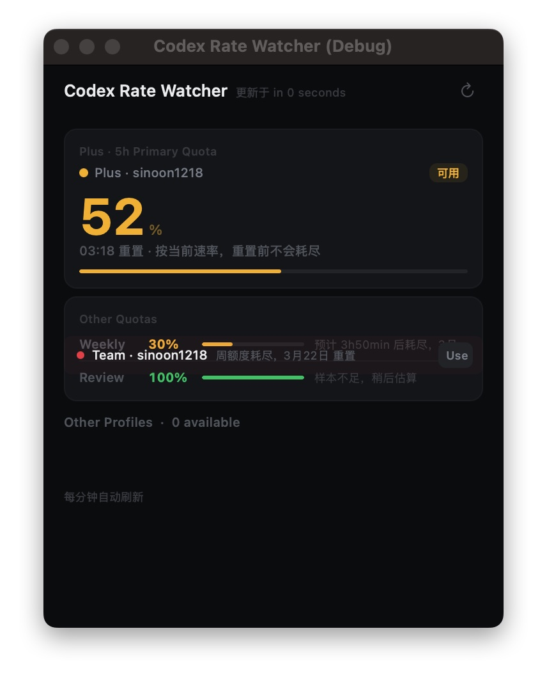

<div align="center">

# ⚡ Codex Rate Watcher

### 再也不会在编程途中被限速打断

一款极速 macOS 菜单栏应用，实时监控 [OpenAI Codex](https://openai.com/index/codex/)（ChatGPT Pro / Team）的速率限制用量 —— 支持多账号管理、消耗速率预测和智能切换。

[](README.md)
[](README.zh-CN.md)
[](README.ja.md)
[](README.ko.md)
[](README.es.md)
[](README.fr.md)
[](README.de.md)


<p>
  
</p>

*实时配额监控 · 消耗速率预测 · 多账号切换 · 重置倒计时*

</div>

---

## 🤯 痛点

你正处于心流状态，和 Codex 结对编程，重构一个关键模块——然后突然，**速率限制的墙迎面撞来**。没有警告，没有倒计时，只有一个冰冷的 `429 Too Many Requests`。

你等待，你刷新，你完全不知道配额什么时候重置，也不知道自己消耗了多快。

**Codex Rate Watcher** 彻底解决这个问题。

## 🎯 核心功能

Codex Rate Watcher 驻留在 macOS 菜单栏，让你对 OpenAI Codex / ChatGPT 的速率限制用量**一目了然**：

| 能力 | 描述 |
|---|---|
| **📊 实时配额追踪** | 同时监控 5 小时主配额、周配额和代码审查配额 |
| **🔥 消耗速率预测** | 精确预测配额耗尽时间（如"预计 1h32min 后耗尽，14:30 重置"） |
| **⏰ 重置倒计时** | 每张配额卡片都显示重置时间——不仅仅是被封锁时 |
| **👥 多账号管理** | 自动捕获账号快照；Plus 和 Team 账号并行管理 |
| **🧠 智能切换** | 加权评分算法推荐最佳切换目标 |
| **🔄 孤儿快照自动整合** | 启动时自动发现并注册未索引的认证快照 |
| **🏷️ 套餐标识** | UI 中清晰标注 Plus / Team |
| **🎨 深色主题 UI** | Linear 风格设计，配额卡片颜色编码 |

## ✨ 功能亮点

- **菜单栏状态** —— 剩余百分比始终可见
- **三维度追踪** —— 5h 主窗口 + 周窗口 + 代码审查限制
- **消耗速率预测** —— 基于用量样本的线性回归预测耗尽时间
- **每张卡片显示重置时间** —— 活跃账号也能看到"预计 1h32min 后耗尽，14:30 重置"
- **五级可用性排序** —— 可用 → 即将耗尽 → 已封锁 → 错误 → 未验证
- **一键切换账号** —— 切换前自动备份
- **认证文件监听** —— 通过 kqueue 实时检测 `codex login`
- **孤儿快照整合** —— 即使索引损坏也不会丢失账号
- **调试窗口模式** —— `--window` 标志启动独立窗口（方便截图和调试）
- **零依赖** —— 纯 Apple 系统框架，无第三方包

## 🚀 快速开始

### 前置条件

- **macOS 14**（Sonoma）或更高版本
- **Codex CLI** 已安装并登录（`~/.codex/auth.json`）
- **Swift 6.2+**（Xcode 26 或 [swift.org](https://swift.org) 工具链）

### 安装与运行

```bash
# 克隆仓库
git clone https://github.com/sinoon/codex-rate-watcher.git
cd codex-rate-watcher

# 直接运行
swift run

# 或构建 release .app 包
swift build -c release
./scripts/build_app.sh
# → dist/Codex Rate Watcher Native.app
```

### 调试窗口模式

```bash
swift run CodexRateWatcherNative -- --window
```

以独立窗口启动，而非菜单栏弹窗——适合截图和 UI 调试。

## 🔬 工作原理

```
~/.codex/auth.json            ← Codex CLI 登录时写入
        │
        ▼
   AuthStore（读取令牌）
        │
        ▼
   UsageAPIClient ──────────► chatgpt.com/backend-api/wham/usage
        │
        ▼
   UsageMonitor（每 60 秒轮询）
    │         │
    │         ▼
    │    SampleStore（持久化样本）
    │         │
    │         ▼
    │    UsageEstimator（消耗速率预测）
    │
    ▼
   AuthProfileStore（多账号管理）
    │         │
    │         ▼
    │    AuthFileWatcher（检测账号变更）
    │
    ▼
   AppDelegate（状态栏）◄──► PopoverViewController（GUI）
```

### 消耗速率预测引擎

预测器使用**线性回归**分析时间序列用量样本：

1. 筛选当前速率限制窗口内的样本（按 `reset_at` 匹配）
2. 选取近期样本（主配额回溯 3h，周配额回溯 3d）
3. 计算 `Δ 用量 / Δ 时间` → 每小时消耗率
4. 预测 `剩余 / 速率` → 耗尽时间
5. 如果窗口在耗尽前重置 → "按当前速率，重置前不会耗尽"

### 智能账号评分

```
score  = min(主配额%, 周配额%) × 3.2    // 均衡可用性（最高权重）
score += 主配额%               × 1.1    // 5h 余量
score += 周配额%               × 0.45   // 周余量
score += 审查配额%             × 0.08   // 代码审查余量
if 即将耗尽: score -= 28                 // 惩罚
if 当前账号: score += 4                  // 留任奖励
```

得分最高的账号被推荐。切换时自动备份当前 `auth.json`。

## 📂 数据存储

所有数据保存在本地。除了调用官方 ChatGPT Usage API，没有任何数据离开你的电脑。

```
~/Library/Application Support/CodexRateWatcherNative/
├── samples.json         # 用量历史（保留 10 天）
├── profiles.json        # 账号配置文件索引
├── auth-profiles/       # 保存的 auth.json 快照（SHA256 指纹）
└── auth-backups/        # 切换前的 auth.json 备份
```

## ⚙️ 技术栈

| 组件 | 技术 |
|---|---|
| 语言 | Swift 6.2 |
| UI 框架 | AppKit（纯代码，无 SwiftUI/XIB） |
| 构建系统 | Swift Package Manager |
| 并发 | Swift Concurrency（async/await, Actor） |
| 网络 | URLSession |
| 加密 | CryptoKit（SHA256 指纹） |
| 文件监听 | GCD DispatchSource（kqueue） |
| 依赖 | **无** —— 纯系统框架 |

## 🤝 贡献

欢迎贡献！你可以：

- 提交 Issue 报告 Bug 或提出功能需求
- 提交 Pull Request
- 分享你的多账号工作流技巧

## 📄 许可证

[MIT](LICENSE) © 2026
