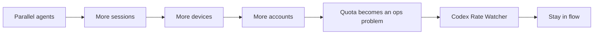

# v2.7.0 Second-Wave Marketing Kit

This document keeps the post-launch messaging for `v2.7.0` aligned across the repo, GitHub Releases, X, and chat announcements.

## Core Positioning

- **Hero line:** `ALL DEVICES. ONE TOKEN VIEW.`
- **Product frame:** Codex quota monitor -> multi-account ops console for Codex power users
- **What changed in v2.7.0:** token cost is no longer local-only; low-risk device ledgers can merge across Macs through iCloud Drive
- **Boundary message:** auth, raw sessions, skills, and MCP configs still stay local



## Messaging Ladder

1. **Pain**
   `429` kills flow with no warning, no reset visibility, and no trustworthy runway estimate.
2. **Operational truth**
   Heavy Codex usage is not just a token problem. It becomes a multi-account, multi-device ops problem.
3. **Product answer**
   Codex Rate Watcher monitors the current account, recommends the next one, projects relay runway, and now merges device ledgers into one all-device token view.
4. **Trust boundary**
   Only compact token ledgers sync. Auth and local tooling state remain local.

## Proof Points To Repeat

- Real-time 5-hour, weekly, and code review quota visibility
- Burn-rate prediction and reset countdowns
- Multi-account scoring, switching, and relay planning
- All-device token totals with per-account breakdown
- Local-device context preserved inside merged views
- Zero-dependency native macOS app in pure Swift

## Asset Pairing

- `docs/screenshot.jpg`
  Use when the story is “watch quota health without leaving flow.”
- `docs/screenshot-relay.jpg`
  Use when the story is “multiple accounts need orchestration, not guesswork.”
- `docs/screenshot-token-cost-hover.jpg`
  Use when the story is “token cost is inspectable, not a mystery.”
- `README.md` mermaid
  Use when the story is “how the iCloud device ledger merge works.”

## Repo / GitHub Copy

### GitHub Repo Description

```text
⚡ A macOS menu bar app for Codex power users: real-time quota visibility, multi-account relay, and all-device token cost syncing through iCloud. Pure Swift.
```

### GitHub Release Hero

```text
Parallel agents turned quota into an ops problem.

Codex Rate Watcher v2.7.0 extends the app from a local quota monitor into an all-device token ledger for Codex power users:
- one token view across your Macs
- per-account burn in the same dashboard
- local-device context preserved
- auth, raw sessions, skills, and MCP configs still local
```

## X Drafts

### Post 1: Single Post

```text
Codex power users do not just have a token problem anymore.

They have a multi-account, multi-device ops problem.

Codex Rate Watcher v2.7.0 now merges low-risk token ledgers across Macs through iCloud:

- all-device totals
- per-account burn
- local-device context

Auth and local tooling state still stay local.

GitHub repo: https://github.com/sinoon/codex-rate-watcher
```

### Post 2: Short Thread

```text
1/ Running Codex across multiple Macs breaks the old “just watch one quota” model.

You need to know:
- which account is healthiest
- where today’s burn came from
- whether the pool survives until reset

2/ Codex Rate Watcher already handled quota visibility, switching, and relay planning.

v2.7.0 adds the missing piece: one all-device token view through iCloud Drive.

3/ Important boundary:
only compact token ledgers sync.

Auth, raw sessions, skills, and MCP configs still stay local.

4/ Repo + downloads:
https://github.com/sinoon/codex-rate-watcher
```

## Chinese Chat / Feishu Draft

```text
Codex Rate Watcher 这次不只是补了一个 iCloud 功能，而是把产品叙事往前推了一步：

并行 agent 时代，额度问题已经不是“看一个账号还剩多少”，而是“多账号、多设备怎么继续不断流地跑”。

v2.7.0 现在已经支持通过 iCloud Drive 合并多台 Mac 的低风险 token ledger：
- 一眼看全部设备总量
- 继续保留按账号拆分
- 本机视角不会丢

边界也卡得很死：auth、原始 session、skill、MCP 配置都还只留在本机。

GitHub:
https://github.com/sinoon/codex-rate-watcher
```

## Comment Reply Hooks

- **“Why not sync auth too?”**
  Because cross-device convenience is not worth turning credentials into cloud state. We sync the ledger, not the keys.
- **“Why does this matter if I use one Mac?”**
  It still works as a local quota and token monitor. The all-device ledger simply upgrades the same surface when more Macs join.
- **“Why not use the OpenAI dashboard?”**
  Because the workflow problem is live quota health, reset timing, switching, and relay runway while you are coding.
